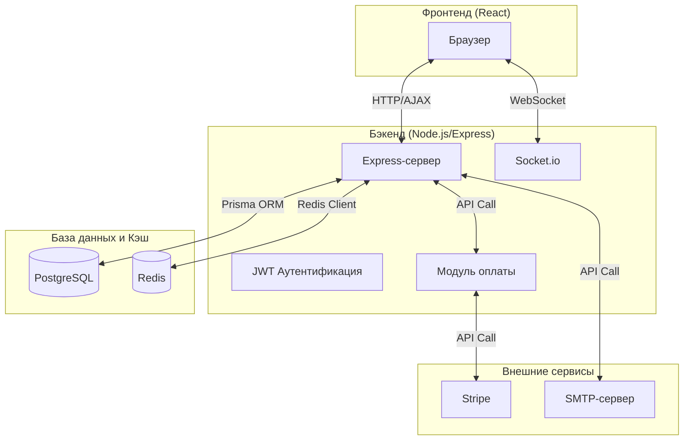
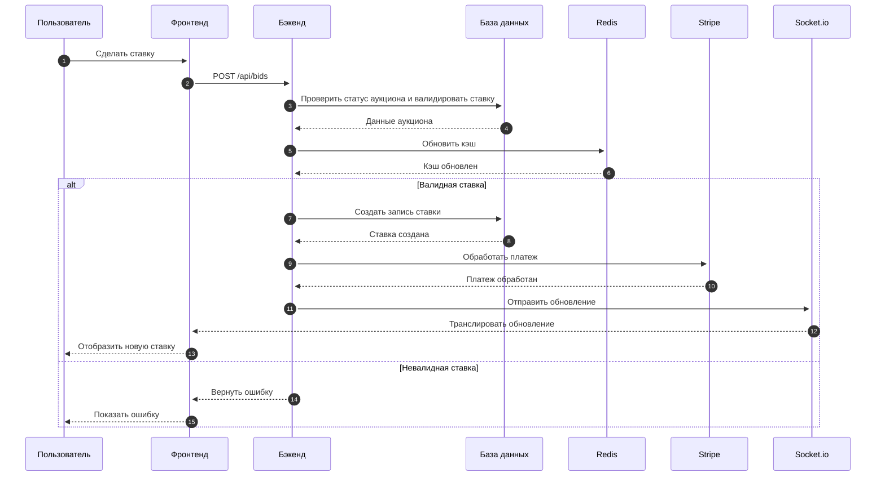

# Global Auction Marketplace

Полнофункциональная торговая площадка для аукционов с использованием React, Node.js, Prisma и Stripe.

## Содержание
- [Описание](#описание)
- [Технологии](#технологии)
- [Архитектура](#архитектура)
- [Установка](#установка)
- [Использование](#использование)
- [Функции](#функции)
- [Документация по API](#документация-по-api)
- [Тестирование](#тестирование)
- [Развертывание](#развертывание)
- [Сотрудничество](#сотрудничество)
- [Лицензия](#лицензия)

## Описание

Этот проект представляет собой полнофункциональное веб-приложение для онлайн-аукционов. Оно позволяет пользователям создавать, управлять и участвовать в онлайн-аукционах. Приложение включает в себя систему торгов в реальном времени, безопасные платежи, аутентификацию пользователей и адаптивный интерфейс.

## Технологии

### Фронтенд
- **React**: Библиотека JavaScript для создания пользовательских интерфейсов.
- **TypeScript**: Строго типизированное надмножество JavaScript, компилируемое в обычный JavaScript.
- **Vite**: Быстрый инструмент сборки для современной веб-разработки.
- **Tailwind CSS**: Утилитарный CSS-фреймворк для быстрого создания собственных дизайнов.
- **React Router DOM**: Декларативные маршруты для приложений на React.
- **Zustand**: Маленький, быстрый и масштабируемый способ управления состоянием.
- **React Hook Form**: Производительные, гибкие формы с простой валидацией.
- **Zod**: Библиотека для объявления схем и валидации, ориентированная на TypeScript.
- **Socket.io Client**: Двусторонняя связь в реальном времени на основе событий.
- **Stripe React & JS**: Библиотеки для интеграции платежей Stripe.
- **Date-fns**: Современная библиотека утилит для работы с датами в JavaScript.
- **Lucide React**: Красивые, простые, идеально пиксельные иконки.
- **clsx**: Крошечная утилита для условного формирования строк className.
- **React Window**: Компоненты React для эффективного отображения больших списков и табличных данных.
- **React Hot Toast**: Доступные уведомления в виде тостов для React.

### Бэкенд
- **Node.js**: Среда выполнения JavaScript, построенная на движке V8 из Chrome.
- **Express**: Быстрый, гибкий, минималистичный веб-фреймворк для Node.js.
- **TypeScript**: Строго типизированное надмножество JavaScript, компилируемое в обычный JavaScript.
- **Prisma**: ORM следующего поколения для Node.js и TypeScript.
- **PostgreSQL**: Мощная, открытая объектно-реляционная система управления базами данных.
- **Socket.io**: Обеспечивает двустороннюю связь в реальном времени на основе событий.
- **Redis**: In-memory хранилище данных, используемое в качестве базы данных, кэша и брокера сообщений.
- **ioredis**: Надежный, высокопроизводительный и полнофункциональный клиент Redis для Node.js.
- **Bull**: Премиум-пакет очередей для обработки распределенных заданий и сообщений в Node.
- **Stripe**: Платформа для обработки онлайн-платежей.
- **Zod**: Библиотека для объявления схем и валидации, ориентированная на TypeScript.
- **JSON Web Token (JWT)**: Компактный, безопасный с точки зрения URL способ представления утверждений.
- **Helmet**: Помогает защитить приложения Express с помощью различных заголовков HTTP.
- **HPP**: Express-промежуточное ПО для защиты от атак загрязнения параметров HTTP.
- **CORS**: Промежуточное ПО для включения Cross-Origin Resource Sharing.
- **Compression**: Промежуточное ПО сжатия для Node.js.
- **Multer**: Промежуточное ПО для обработки multipart/form-data, в основном используемое для загрузки файлов.
- **Cookie Parser**: Разбор заголовка Cookie и заполнение req.cookies.
- **Express Rate Limit**: Простое промежуточное ПО для ограничения частоты запросов в Express.
- **Winston**: Логгер для Node.js.
- **Winston Daily Rotate File**: Транспорт для Winston, который записывает в ротируемый файл.
- **Prometheus Client (prom-client)**: Официальный клиент метрик Prometheus для Node.js.
- **BCryptJS**: Библиотека для хеширования паролей.
- **IP Address (ipaddr.js)**: Библиотека для манипуляций с адресами IPv4 и IPv6.
- **LRU Cache**: Объект кэша, удаляющий наименее часто используемые элементы.
- **Supertest**: Библиотека, управляемая super-agent, для тестирования HTTP-серверов.
- **Vitest**: Блестяще быстрый тестовый раннер.
- **TSX**: Выполнение файлов TypeScript и JavaScript одной командой.

### Разработка & DevOps
- **Concurrently**: Запуск нескольких команд одновременно в npm-скриптах.
- **Nodemon**: Утилита, которая следит за изменениями и автоматически перезапускает сервер.
- **TypeScript Compiler (tsc)**: Компиляция TypeScript в JavaScript.
- **ESLint**: Инструмент статического анализа кода для выявления проблемных шаблонов.
- **PostCSS**: Инструмент для преобразования CSS с помощью плагинов JavaScript.

## Архитектура

### Архитектура высокого уровня
На этой диаграмме показана архитектура приложения в целом, включая фронтенд, бэкенд, базу данных и внешние сервисы.



### Диаграмма потока данных 
На этой диаграмме показан поток данных во время типичного сценария аукциона.



## Установка

1.  Клонируйте репозиторий:
    ```bash
    git clone https://github.com/your-username/global-auction-marketplace.git
    cd global-auction-marketplace
    ```

2.  Установите зависимости для фронтенда и бэкенда:
    ```bash
    npm run install:all
    ```

3.  Настройте переменные окружения (скопируйте `.env.example` в `.env` и заполните значения).

4.  Запустите приложение в режиме разработки:
    ```bash
    npm run dev
    ```

## Использование

- Фронтенд будет доступен по адресу `http://localhost:3000`.
- API бэкенда будет доступно по адресу `http://localhost:5000`.
- Документация Swagger/OpenAPI (если доступна) будет находиться по адресу `/api/docs`.

## Функции

- Регистрация и аутентификация пользователей (JWT).
- Система торгов в реальном времени с использованием WebSockets.
- Безопасная обработка платежей с помощью Stripe.
- Создание, управление и участие в аукционах.
- Профили пользователей и управление аккаунтом.
- Панель администратора для управления пользователями и аукционами.
- Функция загрузки файлов.
- Ограничение частоты запросов и меры безопасности (CORS, Helmet, HPP).
- Комплексное логирование.
- Мониторинг с метриками Prometheus.

## Документация по API

Документация по API доступна через Swagger/OpenAPI по эндпоинту `/api/docs`, когда запущен бэкенд (если настроено).

## Тестирование

Запустите тесты бэкенда с помощью Vitest:
```bash
npm run test
```

Или запустите тесты в режиме наблюдения:
```bash
npm run test:watch
```

## Развертывание

В настоящий момент инструкции по развертыванию находятся в процессе подготовки. Подробные шаги для различных платформ (например, Heroku, AWS, Docker) будут добавлены в будущем.

## Сотрудничество

1. Форкните репозиторий.
2. Создайте ветку для новой функции (`git checkout -b feature/AmazingFeature`).
3. Зафиксируйте свои изменения (`git commit -m 'Add some AmazingFeature'`).
4. Запушьте в ветку (`git push origin feature/AmazingFeature`).
5. Откройте Pull Request.

## Лицензия

Распространяется по лицензии MIT. Смотрите файл `LICENSE` для получения дополнительной информации.
