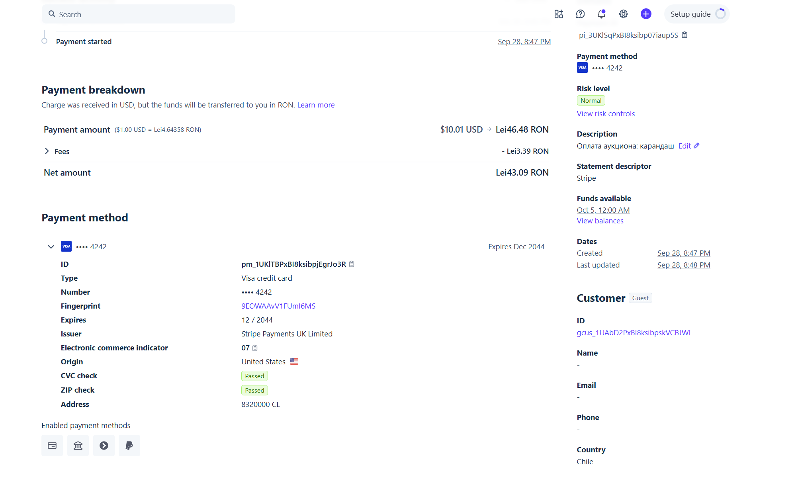
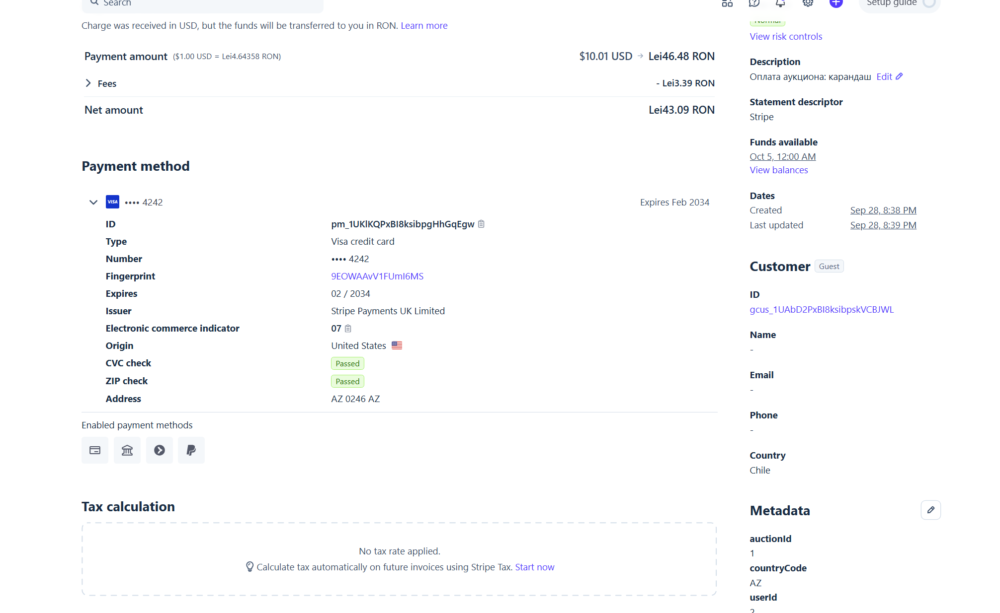
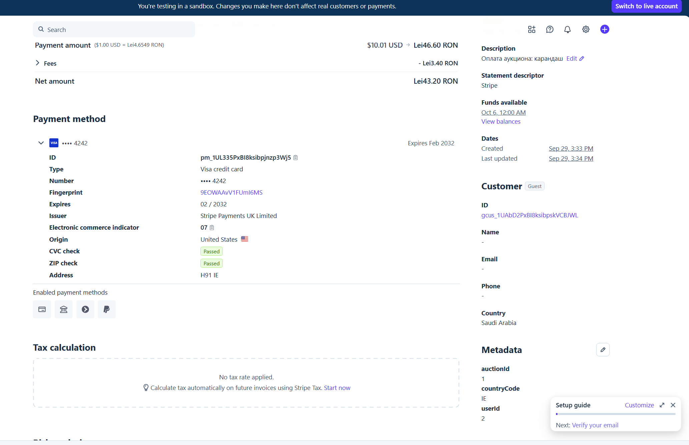
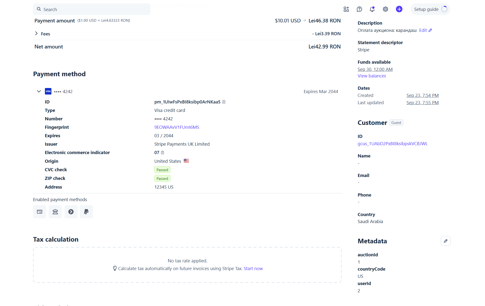

# 🌍 Global Auction Marketplace

<div align="center">

**Продуктовая международная торговая площадка для аукционов** с торгами в реальном времени, платежами через Stripe и проверенной безопасностью.

[](https://www.typescriptlang.org/)
[](https://react.dev/)
[](https://nodejs.org/)
[](https://www.prisma.io/)
[](https://www.postgresql.org/)
[](https://stripe.com/)
[](https://socket.io/)
[](https://vitest.dev/)

</div>

> Полнофункциональная международная торговая площадка для аукционов, построенная на **React 19**, **Node.js/Express**, **Prisma ORM** и **PostgreSQL**. Платформа поддерживает реал-тайм ставки через WebSocket, международные платежи через Stripe с поддержкой 150+ валют, и включает enterprise-уровень безопасности.

## Содержание

- [Описание](#описание)
- [Ключевые особенности](#ключевые-особенности)
- [Архитектура](#архитектура)
- [Технологии](#технологии)
- [Безопасность](#безопасность)
- [Мониторинг и производительность](#мониторинг-и-производительность)
- [Установка](#установка)
- [Использование](#использование)
- [Функции](#функции)
- [Скриншоты](#скриншоты)
- [Тестирование](#тестирование)
- [Линтинг и форматирование](#линтинг-и-форматирование)
- [Развертывание](#развертывание)
- [Сотрудничество](#сотрудничество)
- [Лицензия](#лицензия)

## Описание

**Global Auction Marketplace** — продуктовая международная платформа для онлайн-аукционов. Это не просто CRUD-приложение: это высоконагруженная система с торгами в реальном времени, безопасными платежами через Stripe, защитой от гонок при одновременных действиях, и комплексной системой безопасности.

Проект демонстрирует продвинутые паттерны разработки:
- **Чистая архитектура** с разделением на Контроллеры → Сервисы → Репозитории
- **Защита от гонок** через транзакции Prisma на уровне базы данных
- **Безопасность на уровне предприятия** с 10+ слоями защиты (CSRF, CSP, ограничение запросов, очистка ввода)
- **Коммуникация в реальном времени** через Socket.io с автоматическим переподключением
- **Метрики Prometheus** для мониторинга производительности
- **Курсорная пагинация** для навигации O(1) по большим наборам данных

## Ключевые особенности

### 🚀 Защита от гонок при ставках (Race Condition)

Каждая ставка обрабатывается через **атомарную транзакцию Prisma**, которая одновременно:
1. Проверяет, что аукцион активен и время не вышло
2. Проверяет, что ставка выше текущей
3. Проверяет, что пользователь не продавец
4. Обновляет текущую цену и идентификатор победителя
5. Создаёт запись ставки

Всё это — **в одной транзакции на уровне базы данных**, что полностью исключает гонку при одновременных ставках.

### 🔐 Безопасность на уровне предприятия (10+ слоёв защиты)

| Слой | Технология | Что защищает |
|------|-----------|-------------|
| **CSRF** | Double-submit cookie + криптографическая подпись | CSRF-атаки на все POST/PUT/DELETE |
| **CSP** | Кастомный middleware с 15+ директивами | XSS, clickjacking, frame injection |
| **Ограничение запросов** | LRU-кэш + нормализация IP (IPv4/IPv6) | DDoS, перебор паролей, злоупотребление API |
| **JWT** | Access + Refresh token + tokenVersion | Утечка токенов, сессии |
| **Очистка ввода** | Рекурсивная очистка всех строковых полей | XSS через пользовательский ввод |
| **HPP** | Helmet + HPP middleware | Загрязнение HTTP-параметров |
| **HSTS** | Strict-Transport-Security (1 год) | Перехват SSL |
| **Permissions-Policy** | camera=(), microphone=(), payment=() | Ограничение доступа к API браузера |

### 💳 Интеграция Stripe с ручным списанием (Manual Capture)

Уникальный процесс оплаты, который **замораживает** средства победителя и проигравших:
1. **При ставке** — создаётся PaymentIntent с `payment_method_types: card`
2. **При выигрыше** — статус `AUTHORIZED` (средства заморожены, но не списаны)
3. **При завершении аукциона** — автоматическое списание `capture()` для победителя
4. **Для проигравших** — автоматическая отмена `cancel()` заморозок

Поддержка **150+ валют**, включая валюты без дробной части (JPY, KRW, VND, CLP...).

### 🔄 Система реального времени WebSocket

Сервер Socket.io с:
- **Рассылка по комнатам** — только подписчики получают обновления
- **Middleware авторизации** — проверка JWT при подключении, поддержка гостей
- **Ограничение подключений** — защита от перегрузки WebSocket
- **Автоматическое переподключение** — экспоненциальная задержка с 5 попытками
- **События**: уведомления о создании аукционов, новых ставках, обновлениях, завершении и удалении

### 📊 Мониторинг Prometheus

Метрики для Grafana/Prometheus:
- **HTTP**: гистограмма времени ответа, счётчик запросов
- **База данных**: время запросов + количество по операциям и таблицам
- **WebSocket**: текущие соединения, количество сообщений по событиям
- **Бизнес-метрики**: созданные аукционы, ставки, обработанные платежи

Система готова для прямого сбора метрик Prometheus.

### ⚡ Курсорная пагинация (Cursor-Based)

Более эффективная чем offset/limit:
- **O(1) навигация** — не зависит от объёма данных
- **Составные курсоры** — поддержка нескольких полей сортировки
- **Двусторонняя** — навигация "вперёд" и "назад"
- **Кодировка Base64** — безопасная сериализация курсоров

### 🔄 Автоматическое переподключение к базе данных

Умное переподключение с **экспоненциальной задержкой** для работы с пулами соединений:
- Автоматическое восстановление при обрывах соединений
- Объединение одновременных попыток переподключения (только одна активная)
- Middleware повторов для временных ошибок соединения

### 🧹 Система очистки ввода (Sanitization)

Рекурсивная очистка всех пользовательских данных:
- **Защита от XSS**: удаление опасных тегов и скриптов
- **Очистка URL**: блокировка опасных протоколов
- **Очистка HTML**: whitelist разрешённых тегов
- **Валидация email**: проверка формата + приведение к нижнему регистру + удаление пробелов
- **Очистка чисел**: обнаружение некорректных значений + проверка типов

### 🛠 Корректное завершение работы (Graceful Shutdown)

Обработка системных сигналов завершения (включая Windows Ctrl+C):
- Закрытие HTTP сервера (новые запросы не принимаются)
- Очистка всех таймеров и интервалов
- Отключение connection pool Prisma
- Принудительный выход через 10 секунд (защита от зависания)
- Защита от повторного запуска через внутренний флаг

### 🕐 Фоновая задача (Cron Job)

Автоматическое завершение истёкших аукционов каждые **5 минут**:
- Поиск активных аукционов, время которых истёк и есть победитель
- Автоматическое списание платежа победителя
- Автоматическая отмена заморозок проигравших
- WebSocket уведомление подписчиков

### 🧪 Тестовое покрытие

**18 тестовых файлов** покрывают ключевые компоненты:
- Контроллеры и сервисы (auctions, auth, bids, payments)
- Middleware (auth, CSRF, rate limiting, admin)
- Репозитории (users, payments, auctions, bids)
- Обработка ошибок и фабрики ошибок

Фреймворк: **Vitest** + **Supertest** + **@vitest/coverage-v8**

## Технологии

### Фронтенд

| Технология | Версия | Назначение |
|-----------|--------|-----------|
| **React** | 19 | Библиотека UI с Server Components |
| **TypeScript** | 6 | Статическая проверка типов |
| **Vite** | 8 | Сверхбыстрый инструмент сборки |
| **Tailwind CSS** | 3.4 | CSS-фреймворк утилитарного стиля |
| **React Router DOM** | 6.28 | Маршрутизация с ленивой загрузкой |
| **Zustand** | 5.0 | Управление состоянием |
| **React Hook Form** | 7.54 | Производительные формы с валидацией |
| **Zod** | 3.23 | Проверка схем (общая с бэкендом) |
| **Socket.io-client** | 4.8 | WebSocket связь в реальном времени |
| **Stripe React** | 2.8 | Интеграция платежей |
| **React Window** | 2.2 | Виртуализированные списки |
| **Lucide React** | 0.47 | Иконки |
| **React Hot Toast** | 2.6 | Уведомления |
| **Date-fns** | 4.1 | Утилиты для работы с датами |
| **Axios** | 1.7 | HTTP-клиент с перехватчиками |

### Бэкенд

| Технология | Версия | Назначение |
|-----------|--------|-----------|
| **Node.js** | 20+ | Среда выполнения |
| **Express** | 4.18 | Веб-фреймворк |
| **TypeScript** | 5.3 | Статическая проверка типов |
| **Prisma** | 7.8 | ORM с типобезопасностью |
| **PostgreSQL** | 15+ | Продуктовая база данных |
| **pg adapter** | 7.8 | Прямой драйвер PostgreSQL (без Prisma Proxy) |
| **Socket.io** | 4.7 | Двусторонняя связь в реальном времени |
| **Stripe** | 14.9 | Обработка платежей (150+ валют) |
| **JWT** | 9.0 | Токены авторизации (access + refresh) |
| **bcrypt** | 3.0 | Хеширование паролей |
| **Helmet** | 8.1 | Заголовки безопасности |
| **HPP** | 0.2 | Защита от загрязнения HTTP-параметров |
| **compression** | 1.8 | Сжатие ответов Gzip/Brotli |
| **Winston** | 3.11 | Структурированное логирование |
| **prom-client** | 15.1 | Сбор метрик Prometheus |
| **LRU Cache** | 11.2 | Кэширование в памяти |
| **ipaddr.js** | 2.3 | Обработка адресов IPv4/IPv6 |
| **Multer** | 2.1 | Загрузка файлов |
| **Zod** | 3.22 | Проверка данных во время выполнения |

### Разработка и DevOps

| Инструмент | Назначение |
|-----------|-----------|
| **Biome** | Линтинг + форматирование + организация импортов (в 10 раз быстрее ESLint) |
| **Vitest** | Сверхбыстрые модульные и интеграционные тесты |
| **Supertest** | Библиотека проверки HTTP-запросов для тестирования API |
| **Knip** | Поиск неиспользуемого кода и зависимостей |
| **Nodemon** | Автоматический перезапуск при изменении файлов |
| **TSX** | Выполнение TypeScript без этапа сборки |

## Архитектура

Проект следует принципам **чистой архитектуры** с чётким разделением ответственности:

```
┌─────────────────────────────────────────────────────────┐
│                     Client (React 19)                    │
│  ┌──────────┐  ┌──────────┐  ┌──────────────────────┐   │
│  │ Zustand  │  │ React    │  │ Socket.io-client     │   │
│  │ Store    │  │ Router   │  │ + WebSocket handlers │   │
│  └──────────┘  └──────────┘  └──────────────────────┘   │
└────────────────────────┬────────────────────────────────┘
                         │ HTTP / WebSocket
┌────────────────────────▼────────────────────────────────┐
│                   Server (Express + TS)                  │
│  ┌──────────────────────────────────────────────────┐   │
│  │              Middleware Layer                      │   │
│  │  Helmet → CORS → Compression → Security Headers  │   │
│  │  Rate Limit → CSRF → Auth → Metrics              │   │
│  └──────────────────────────────────────────────────┘   │
│  ┌────────────┐  ┌──────────┐  ┌──────────────────┐    │
│  │  Routes    │  │Controllers│  │  Error Handler   │    │
│  │ (REST API) │  │ (HTTP)   │  │ (Zod/Prisma)     │    │
│  └─────┬──────┘  └────┬─────┘  └────────┬─────────┘    │
│        └───────────────┼────────────────┘               │
│  ┌─────────────────────┼──────────────────┐            │
│  │              Service Layer               │            │
│  │  • auctions.service.ts (15KB)           │            │
│  │  • payments.service.ts (17.4KB)         │            │
│  │  • bids.service.ts + transaction lock   │            │
│  │  • auth.service.ts + JWT flow           │            │
│  └─────────────────────┼──────────────────┘            │
│  ┌─────────────────────┼──────────────────┐            │
│  │            Repository Layer              │            │
│  │  • auctions.repository.ts (8.3KB)       │            │
│  │  • payments.repository.ts (3.9KB)       │            │
│  │  • bids.repository.ts + users           │            │
│  └─────────────────────┼──────────────────┘            │
│  ┌─────────────────────┼──────────────────┐            │
│  │           Config Layer                     │            │
│  │  • db.ts (Prisma + pg Pool)              │            │
│  │  • jwt.ts, stripe.ts, socket.ts          │            │
│  │  • metrics.ts (Prometheus)               │            │
│  │  • logger.ts (Winston)                   │            │
│  └──────────────────────────────────────────┘            │
└─────────────────────────────────────────────────────────┘
                         │
         ┌───────────────┼───────────────┐
         ▼               ▼               ▼
   ┌───────────┐  ┌───────────┐  ┌─────────────┐
   │PostgreSQL │  │  Stripe   │  │  Socket.io  │
   │  (Prisma) │  │  API      │  │  (WS)       │
   └───────────┘  └───────────┘  └─────────────┘
```

### Слои ответственности

| Слой | Задача |
|------|--------|
| **Маршруты** | Определение endpoints и цепочка middleware |
| **Контроллеры** | Отображение HTTP request/response |
| **Сервисы** | Бизнес-логика, транзакции, валидация |
| **Репозитории** | Запросы ORM, доступ к данным |
| **Middleware** | Безопасность, авторизация, ограничение |
| **Конфигурация** | Интеграции с внешними сервисами |
| **Типы** | Интерфейсы, общие типы |
| **Утилиты** | Вспомогательные функции: пагинация, очистка |

## Безопасность

### Защита от OWASP Top 10

| Уязвимость | Решение |
|-----------|---------|
| **A02: Провалы криптографии** | Хеширование паролей + криптографические токены CSRF + подписание JWT |
| **A03: Инъекции** | ORM с параметризованными запросами + очистка ввода |
| **A07: Ошибки идентификации и авторизации** | Токены авторизации + ограничение запросов + инвалидация сессий |
| **A09: Логирование и мониторинг** | Структурированное логирование + метрики + обработка ошибок |

### Заголовки безопасности (каждый HTTP-ответ)

Сервер устанавливает заголовки для защиты от XSS, clickjacking и других атак: Content-Security-Policy, защита от просмотра в фрейме, запрет на анализ типов контента, политика реферера, ограничения на использование API браузера, строгая транспортная безопасность.

### Защита CSRF

Шаблон double-submit cookie с криптографической подписью:
1. Сервер генерирует криптографический уникальный токен
2. Вычисляется хеш-сумма секретного ключа и токена
3. Подписанный токен хранится в безопасной httpOnly cookie
4. Клиент отправляет тот же токен в заголовке запроса
5. Сервер проверяет подпись за постоянное время (постоянное время выполнения)

### Ограничение запросов (Rate Limiting)

- **Кэш в памяти**: хранение записей с автоматической очисткой
- **Нормализация IP**: приведение IPv6-форматов к IPv4, обработка локальных адресов
- **Учёт прокси**: учёт заголовков клиента для работы через Docker/K8s
- **Доверенные подсети**: частные сети исключены из подсчёта
- **Настраиваемый**: разные лимиты для production и development

## Мониторинг и производительность

### Метрики Prometheus

Система собирает метрики для мониторинга в Grafana/Prometheus:
- **HTTP-запросы**: время ответа и общее количество с разбивкой по методу, маршруту и коду ответа
- **База данных**: время запросов и количество операций по типам и таблицам
- **WebSocket**: текущие соединения и количество сообщений
- **Бизнес-метрики**: созданные аукционы, сделанные ставки, обработанные платежи

Данные метрики доступны для прямого сбора инструментами Prometheus.

### Управление ресурсами

- **Обнаружение утечек памяти**: периодическая проверка каждые 10 минут
- **Настройки среды выполнения**: управление сборщиком мусора для стабильной работы
- **Корректное завершение**: обработка системных сигналов с принудительным выходом через 10 секунд
- **Connection pool**: оптимизирован для работы через прокси-пулы соединений

## Установка

1.  Клонируйте репозиторий:

    ```bash
    git clone https://github.com/your-username/global-auction-marketplace.git
    cd global-auction-marketplace
    ```

2.  Установите зависимости для фронтенда и бэкенда:

    ```bash
    npm run install:all
    ```

3.  Настройте переменные окружения (скопируйте `.env.example` в `.env` и заполните значения).

4.  Запустите приложение в режиме разработки:
    ```bash
    npm run dev
    ```

## Использование

- Фронтенд будет доступен по адресу `http://localhost:3000`.
- API бэкенда будет доступно по адресу `http://localhost:5000`.
- Документация Swagger/OpenAPI (если доступна) будет находиться по адресу `/api/docs`.

## Функции

### Аутентификация и авторизация
- ✅ Регистрация и вход с JWT + refresh token (httpOnly cookie)
- ✅ Автоматический refresh access token при инициализации
- ✅ Protected routes с Loading spinner
- ✅ Lazy loading страниц для code splitting
- ✅ Middleware: auth, admin, CSRF, rate limiting

### Аукционы
- ✅ Создание, редактирование, удаление аукционов
- ✅ Фильтрация по статусу (ACTIVE, COMPLETED, CANCELLED)
- ✅ Пагинация (page/limit + cursor-based)
- ✅ Автоматическое завершение истёкших аукционов (cron каждые 5 мин)
- ✅ Обновления в реальном времени через WebSocket

### Ставки
- ✅ Ставки в реальном времени с защитой от гонок (Prisma transaction)
- ✅ Валидация: сумма ставки выше текущей, время не вышло, не свой аукцион
- ✅ История ставок с пагинацией
- ✅ WebSocket уведомления о новых ставках

### Платежи (Stripe)
- ✅ Payment Intent с поддержкой 150+ валют
- ✅ Zero-decimal currencies (JPY, KRW, VND, CLP...)
- ✅ Manual capture после победы в аукционе
- ✅ Автоматическая отмена холдов проигравших
- ✅ Webhook обработка: succeeded, failed, canceled, refunded
- ✅ Payment history с пагинацией

### WebSocket в реальном времени
- ✅ Рассылка по комнатам — только подписчики получают обновления
- ✅ JWT аутентификация при подключении
- ✅ Поддержка гостей (анонимные подключения)
- ✅ Connection rate limiting
- ✅ События: уведомления о создании аукционов, новых ставках, обновлениях, завершении и удалении

### Администрирование
- ✅ Панель администратора
- ✅ Управление пользователями и аукционами
- ✅ Refund обработка платежей

## Как это работает

### Процесс ставки (без гонки)

```
Пользователь нажимает "Сделать ставку"
  │
  ├─ Фронтенд: проверяет валидность суммы ставки
  │
  ├─ API: POST /api/auctions/:id/bids { amount }
  │
  ├─ Middleware: авторизация → проверка CSRF → ограничение запросов
  │
  └─ Сервис: bids.service.createBid()
       │
       ├─ 1. Загрузка данных аукциона из БД
       │
       ├─ 2. Ранняя проверка (время не вышло, валюта совпадает)
       │
       └─ 3. prisma.$transaction([
            ├─ auctions.update({
            │    where: { id, статус активен, время не вышло, сумма валидна, пользователь не продавец },
            │    data: { обновлённая цена, идентификатор победителя }
            │  })
            │
            └─ bids.create({ auctionId, userId, amount })
          ])
          │
          ├─ ✅ Успех → WebSocket рассылка уведомления о ставке
          └─ ❌ Ошибка → "Аукцион не найден, не активен, завершён или ставка слишком низкая"
```

### Процесс платежей (ручное списание)

```
1. Пользователь делает ставку
   └─ PaymentIntent создан (статус: PENDING)

2. Stripe подтверждает платёж
   └─ Webhook: payment_intent.requires_capture
   └─ Статус платежа → AUTHORIZED (средства заморожены, но не списаны)

3. Аукцион завершён → определён победитель
   └─ Автоматическое завершение (каждые 5 минут)
   └─ capturePayment(winnerPaymentId) → статус COMPLETED
   └─ cancelHold(otherPayments) → статус удалён (средства возвращены)

4. Если аукцион отменён / нет победителя
   └─ cancelHold(allPayments) → средства автоматически возвращаются
```

## Скриншоты

### Международные платежи

Успешные транзакции из разных стран через Stripe:

### Международная оплата — успешная транзакция из Чили



На скриншоте показана успешно завершённая операция оплаты через Stripe с аукциона из страны Чили.

### Международная оплата — успешная транзакция из Азербайджана



На скриншоте показана успешно завершённая операция оплаты через Stripe с аукциона из Азербайджана.

### Международная оплата — успешная транзакция из Саудовской Аравии



На скриншоте показана успешно завершённая операция оплаты через Stripe с аукциона из Саудовской Аравии.

### Международная оплата — успешная транзакция из США



На скриншоте показана успешно завершённая операция оплаты через Stripe с аукциона из Соединённых Штатов Америки.

## Документация по API

Документация по API доступна через Swagger/OpenAPI по эндпоинту `/api/docs`, когда запущен бэкенд (если настроено).

## Тестирование

**18 тестовых файлов** покрывают ключевые компоненты системы:

| Модуль | Тесты |
|--------|-------|
| **Сервисы** | Тесты авторизации, ставок, платежей |
| **Маршруты/Контроллеры** | Тесты аукционов, авторизации, ставок, платежей |
| **Middleware** | Тесты авторизации, CSRF, ограничения запросов, администрирования |
| **Репозитории** | Тесты аукционов, ставок, платежей, пользователей |
| **Обработка ошибок** | Тесты обработчиков и фабрик ошибок |
| **Утилиты** | Тесты вспомогательных функций |

```bash
# Запуск всех тестов
npm run test

# Watch mode
npm run test:watch

# Coverage
npm run test -- --coverage
```

## Линтинг и Форматирование

Проект использует **Biome** — сверхбыстрый инструмент для линтинга, форматирования и организации импортов.

```bash
# Авто-исправления (lint + format + organize imports)
npm run lint:fix

# Проверка без изменений
npm run lint

# Форматирование
npm run format

# Проверка формата без изменений
npm run format:check

# Полный чек (lint + type-check)
npm run validate
```

### Дополнительные инструменты качества

- **Knip**: Поиск неиспользуемых файлов, зависимостей и экспортов
- **TypeScript**: Компиляция в строгом режиме (strict mode)

## Развертывание

### Production Build

```bash
# Бэкенд
cd backend
npm run build
NODE_ENV=production node dist/index.js

# Фронтенд
cd frontend
npm run build
# файлы в frontend/dist/
```

### Чек-лист для Production

- [ ] `.env` с production переменными
- [ ] `NODE_ENV=production`
- [ ] STRIPE_WEBHOOK_SECRET настроен
- [ ] CSRF_SECRET сгенерирован (crypto.randomBytes(32))
- [ ] DATABASE_URL с SSL
- [ ] Проксируемые заголовки через Nginx/Caddy
- [ ] HTTPS с валидным SSL-сертификатом
- [ ] `DATABASE_REJECT_UNAUTHORIZED=true` с валидным сертификатом

### Docker (скоро)

Docker Compose конфигурация для развёртывания с PostgreSQL и Stripe CLI.

## Сотрудничество

1. Форкните репозиторий.
2. Создайте ветку для новой функции (`git checkout -b feature/AmazingFeature`).
3. Зафиксируйте свои изменения (`git commit -m 'Add some AmazingFeature'`).
4. Запушьте в ветку (`git push origin feature/AmazingFeature`).
5. Откройте Pull Request.

## Лицензия

Распространяется по лицензии MIT. Смотрите файл `LICENSE` для получения дополнительной информации.
